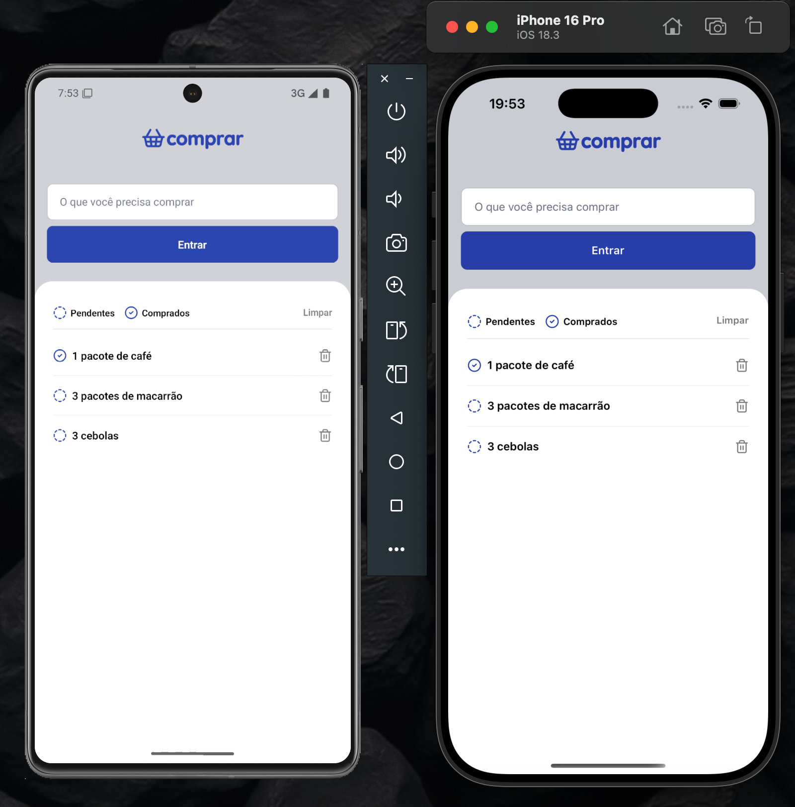

# APP COMPRAR

Aplicativo simples de lista de compras desenvolvido em React Native e Expo. Adicione, filtre e gerencie itens que você precisa comprar de forma prática.

## Funcionalidades

- Adicionar itens à lista de compras
- Marcar itens como "Pendentes" ou "Comprados"
- Filtrar itens por status
- Remover itens individualmente ou limpar toda a lista
- Armazenamento persistente com AsyncStorage

## Pré-requisitos

- [Node.js](https://nodejs.org/)
- [Expo CLI](https://docs.expo.dev/get-started/installation/)
- [Yarn](https://yarnpkg.com/) ou [npm](https://www.npmjs.com/)

## Instalação

Clone o repositório e instale as dependências:

```sh
git clone <url-do-repositorio>
cd comprar
npm install
```

## Como executar

Inicie o servidor de desenvolvimento:

```sh
npm start
```

Para rodar no Android:

```sh
npm run android
```

Para rodar no iOS:

```sh
npm run ios
```

Para rodar no navegador:

```sh
npm run web
```

## Estrutura do Projeto

- `src/components`: Componentes reutilizáveis de UI
- `src/storage`: Lógica de armazenamento com AsyncStorage
- `src/types`: Definições de tipos
- `src/views/Home`: Tela principal e estilos

## Contribuição

Contribuições são bem-vindas! Para grandes mudanças, abra uma issue para discutir o que deseja modificar.

## Licença

[MIT](LICENSE)

### UI DESIGN

